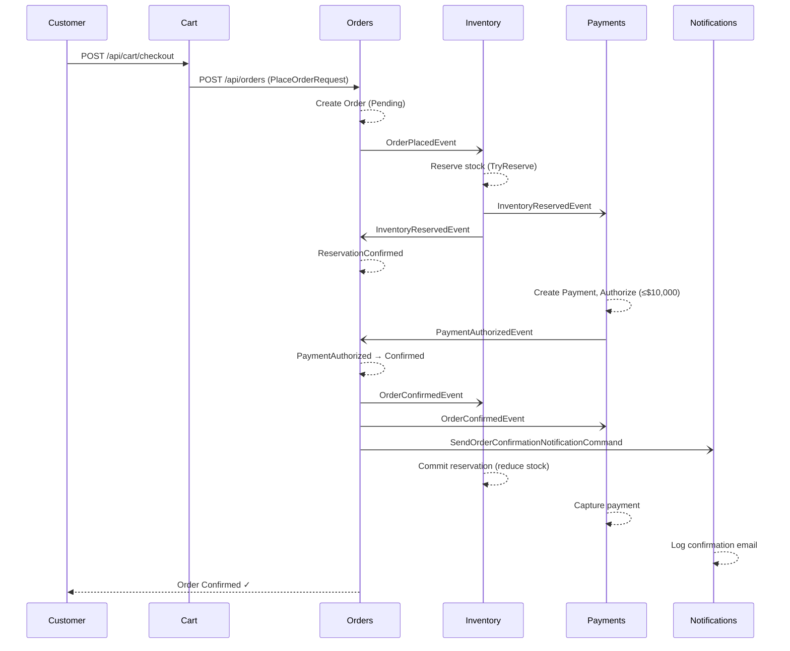
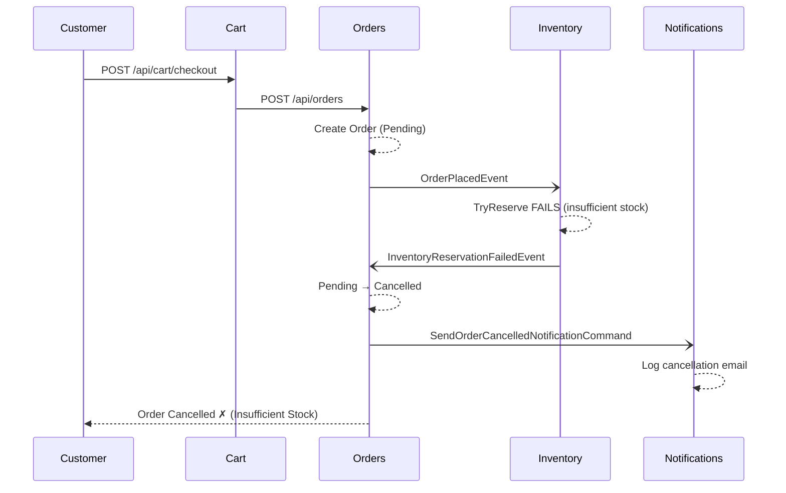
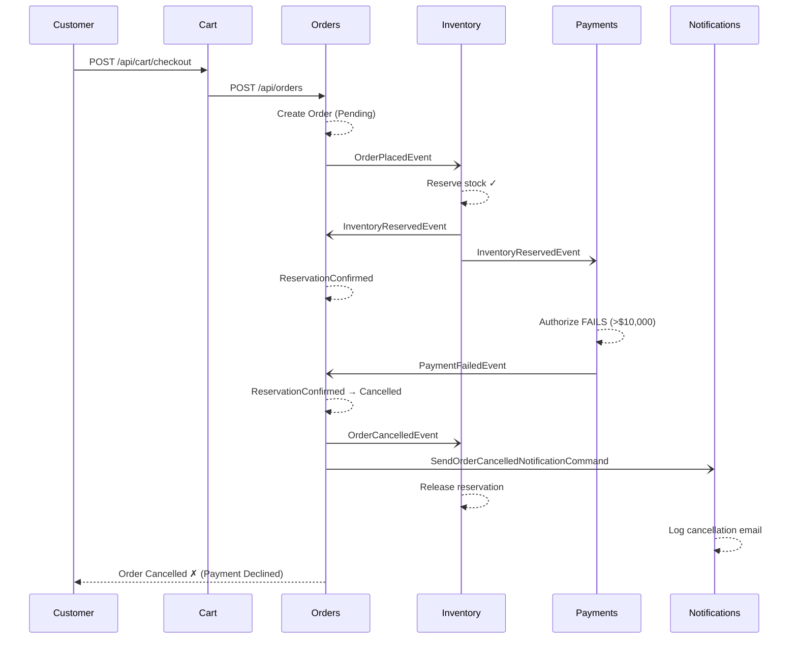
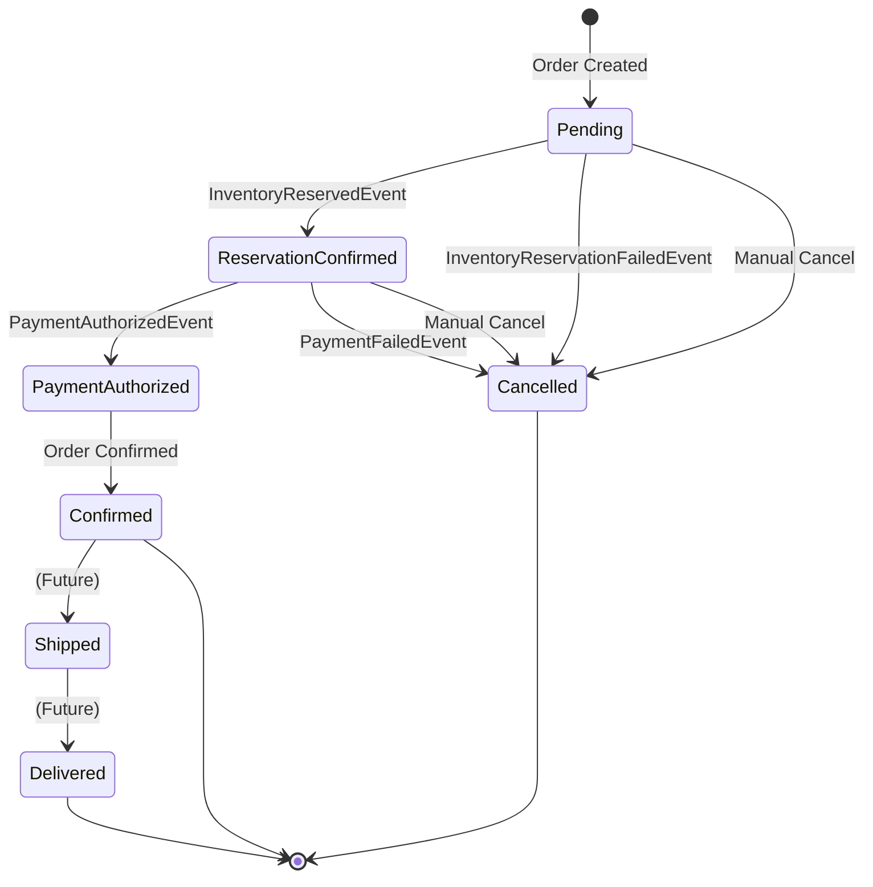
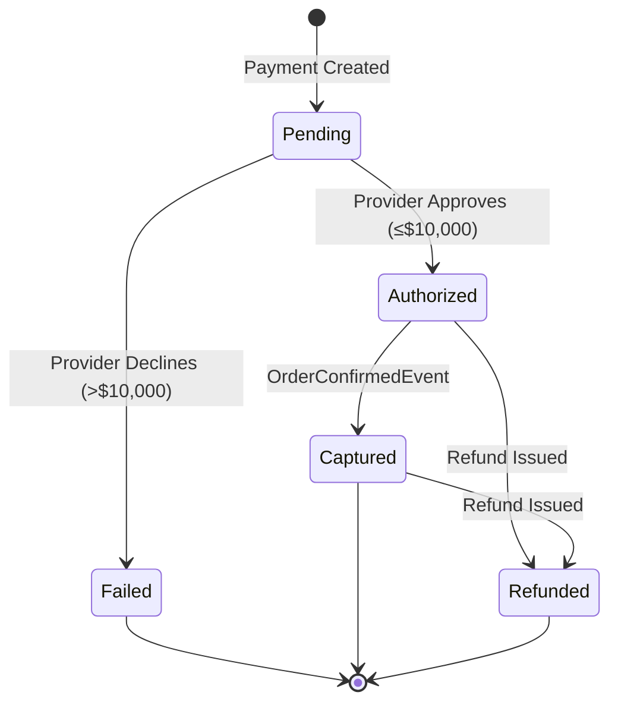
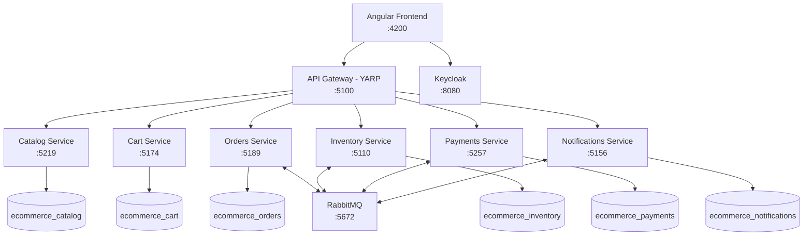
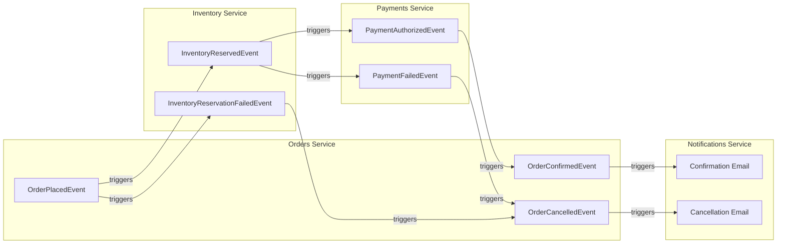

# ECommerce Platform — User & Admin Manual

> **Version**: 1.0 | **Last Updated**: March 2026
>
> A comprehensive guide for end-users (customers) and administrators on how to operate the ECommerce microservices platform.

---

## Table of Contents

1. [Platform Overview](#1-platform-overview)
2. [Prerequisites & Setup](#2-prerequisites--setup)
3. [Starting the Platform](#3-starting-the-platform)
4. [Authentication & Login](#4-authentication--login)
5. [User Guide — Shopping Workflow](#5-user-guide--shopping-workflow)
   - 5.1 [Browsing the Catalog](#51-browsing-the-catalog)
   - 5.2 [Managing Your Cart](#52-managing-your-cart)
   - 5.3 [Checkout & Placing an Order](#53-checkout--placing-an-order)
   - 5.4 [Tracking Your Orders](#54-tracking-your-orders)
6. [Admin Guide — Platform Management](#6-admin-guide--platform-management)
   - 6.1 [Product Management](#61-product-management)
   - 6.2 [Inventory Management](#62-inventory-management)
   - 6.3 [Payment Monitoring](#63-payment-monitoring)
   - 6.4 [Notification Logs](#64-notification-logs)
   - 6.5 [Order Cancellation](#65-order-cancellation)
7. [Order Lifecycle & Workflow Diagrams](#7-order-lifecycle--workflow-diagrams)
   - 7.1 [Happy Path — Successful Order](#71-happy-path--successful-order)
   - 7.2 [Failure Path — Insufficient Inventory](#72-failure-path--insufficient-inventory)
   - 7.3 [Failure Path — Payment Declined](#73-failure-path--payment-declined)
   - 7.4 [Order State Machine](#74-order-state-machine)
   - 7.5 [Payment State Machine](#75-payment-state-machine)
8. [Service Architecture Overview](#8-service-architecture-overview)
9. [API Reference](#9-api-reference)
   - 9.1 [Gateway](#91-gateway)
   - 9.2 [Catalog Service](#92-catalog-service)
   - 9.3 [Cart Service](#93-cart-service)
   - 9.4 [Orders Service](#94-orders-service)
   - 9.5 [Inventory Service](#95-inventory-service)
   - 9.6 [Payments Service](#96-payments-service)
   - 9.7 [Notifications Service](#97-notifications-service)
10. [Configuration Reference](#10-configuration-reference)
11. [Troubleshooting](#11-troubleshooting)
12. [Glossary](#12-glossary)

---

## 1. Platform Overview

The ECommerce Platform is a microservices-based online store comprising:

| Component | Description |
|-----------|-------------|
| **Angular Frontend** | Single-page application for customers and admins |
| **API Gateway** | YARP reverse proxy routing all `/api/*` traffic |
| **Catalog Service** | Product listing, search, and CRUD |
| **Cart Service** | Shopping cart with per-user isolation |
| **Orders Service** | Order placement and lifecycle state machine |
| **Inventory Service** | Stock tracking, reservations, and restocking |
| **Payments Service** | Payment authorization and capture (simulated) |
| **Notifications Service** | Order confirmation and cancellation email logs |

All services communicate asynchronously through **RabbitMQ** message queues using a choreography-based saga pattern — no single orchestrator controls the workflow.

---

## 2. Prerequisites & Setup

### Required Software

| Software | Version | Default Port | Purpose |
|----------|---------|-------------|---------|
| .NET SDK | 10.0+ | — | Build & run backend services |
| Node.js | 18+ | — | Build & run Angular frontend |
| PostgreSQL | 16+ | 5432 | Per-service databases |
| RabbitMQ | 3.13+ | 5672 (AMQP), 15672 (Management) | Async messaging |
| Keycloak | 24+ | 8080 | Identity & access management |

### Keycloak Setup

1. Start Keycloak on `http://localhost:8080`
2. Create a realm named **`ecommerce`**
3. Create a client with audience **`account`**
4. Create user accounts and assign roles:
   - **Regular users**: default role for shopping
   - **Admin users**: admin role for product/inventory management

### Database Setup

Databases are created automatically on first service startup (`EnsureCreated()`). The following databases will be created on PostgreSQL:

| Database Name | Service |
|---------------|---------|
| `ecommerce_catalog` | Catalog |
| `ecommerce_cart` | Cart |
| `ecommerce_orders` | Orders |
| `ecommerce_inventory` | Inventory |
| `ecommerce_payments` | Payments |
| `ecommerce_notifications` | Notifications |

Default PostgreSQL credentials: `postgres` / `postgres`

---

## 3. Starting the Platform

### Option A: Run All Services (Batch Script)

```bash
# From project root
run-all-services.bat
```

### Option B: Run Services Individually

```bash
# Terminal 1 — Gateway
dotnet run --project src/Gateway/Gateway.Api

# Terminal 2 — Catalog
dotnet run --project src/Services/Catalog/Catalog.Api

# Terminal 3 — Cart
dotnet run --project src/Services/Cart/Cart.Api

# Terminal 4 — Orders
dotnet run --project src/Services/Orders/Orders.Api

# Terminal 5 — Inventory
dotnet run --project src/Services/Inventory/Inventory.Api

# Terminal 6 — Payments
dotnet run --project src/Services/Payments/Payments.Api

# Terminal 7 — Notifications
dotnet run --project src/Services/Notifications/Notifications.Api
```

### Option C: Start the Frontend

```bash
cd src/ecommerce-ui
npm install
npm start
```

### Service Ports Reference

| Service | Gateway Port | Direct Port |
|---------|-------------|-------------|
| Gateway | **5100** | — |
| Catalog | 5101 | 5219 |
| Cart | 5102 | 5174 |
| Orders | 5103 | 5189 |
| Inventory | 5104 | 5110 |
| Payments | 5105 | 5257 |
| Notifications | 5106 | 5156 |

### Verifying Services Are Running

Check each service's health endpoint:

```
GET http://localhost:5100/health          # Gateway
GET http://localhost:5219/health          # Catalog
GET http://localhost:5174/health          # Cart
GET http://localhost:5189/health          # Orders
GET http://localhost:5110/health          # Inventory
GET http://localhost:5257/health          # Payments
GET http://localhost:5156/health          # Notifications
```

All healthy services return HTTP `200 OK`.

---

## 4. Authentication & Login

### Via the Web UI

1. Navigate to the application (default: `http://localhost:4200`)
2. You are redirected to **Login** (`/auth/login`)
3. Click **Login** to be redirected to the Keycloak login page
4. Enter your credentials (created during Keycloak setup)
5. On successful login, Keycloak redirects back to `/auth/callback`
6. You are redirected to the **Dashboard** (`/dashboard`)

### Roles & Permissions

| Role | Catalog | Cart | Orders | Inventory | Payments | Notifications |
|------|---------|------|--------|-----------|----------|---------------|
| **User** | Browse, view details | Full access | Place, view, cancel own | — | — | — |
| **Admin** | Full CRUD + manage | Full access | Full access | Full access | View payments | View logs |

### Via API (Bearer Token)

For direct API access, obtain a JWT from Keycloak:

```bash
# Get an access token from Keycloak
curl -X POST http://localhost:8080/realms/ecommerce/protocol/openid-connect/token \
  -d "grant_type=password" \
  -d "client_id=account" \
  -d "username=YOUR_USERNAME" \
  -d "password=YOUR_PASSWORD"
```

Include the token in all authenticated requests:

```
Authorization: Bearer <access_token>
```

---

## 5. User Guide — Shopping Workflow

### 5.1 Browsing the Catalog

**Web UI**: Navigate to **Catalog** (`/catalog`)

The product list page displays all active products with:
- Product name, description, and category
- Price and currency
- Pagination controls (default: 20 per page)
- Category filtering

Click any product to view its **detail page** (`/catalog/:id`).

**API Equivalent**:

```http
# List products (paginated, filter by category)
GET http://localhost:5100/api/products?page=1&pageSize=20&category=Electronics

# Get a single product
GET http://localhost:5100/api/products/{productId}
```

### 5.2 Managing Your Cart

**Web UI**: Navigate to **Cart** (`/cart`)

| Action | How |
|--------|-----|
| **Add item** | Click "Add to Cart" on any product page |
| **Change quantity** | Edit the quantity field in the cart view |
| **Remove item** | Click the remove/delete button next to an item |
| **Clear cart** | Click "Clear Cart" to remove all items |

The cart displays:
- All items with name, unit price, quantity, and line total
- **Total amount** at the bottom

**API Equivalent**:

```http
# View your cart
GET http://localhost:5100/api/cart

# Add an item
POST http://localhost:5100/api/cart/items
Content-Type: application/json
{
  "productId": "...",
  "productName": "Laptop",
  "unitPrice": 999.99,
  "quantity": 1
}

# Update quantity
PUT http://localhost:5100/api/cart/items
Content-Type: application/json
{
  "productId": "...",
  "quantity": 3
}

# Remove an item
DELETE http://localhost:5100/api/cart/items/{productId}

# Clear entire cart
DELETE http://localhost:5100/api/cart
```

### 5.3 Checkout & Placing an Order

**Web UI**: Navigate to **Checkout** (`/cart/checkout`)

1. Review your cart items and total
2. Confirm your name and email
3. Click **Place Order**
4. The system:
   - Creates an order from your cart items
   - Clears your cart
   - Begins the asynchronous order fulfillment workflow
5. You are redirected to your order detail page

> **Important**: Each checkout generates a unique **idempotency key**. If a network error occurs and you retry, the system prevents duplicate orders.

> **Note on Payment Simulation**: The payment provider is simulated. Orders with **total amount ≤ $10,000** are auto-approved. Orders **> $10,000** are auto-declined.

**API Equivalent**:

```http
# Checkout (converts cart → order, clears cart)
POST http://localhost:5100/api/cart/checkout
Content-Type: application/json
{
  "customerEmail": "user@example.com",
  "customerName": "John Doe",
  "idempotencyKey": "unique-key-here"
}

# Or place an order directly (bypassing cart)
POST http://localhost:5100/api/orders
Content-Type: application/json
{
  "customerEmail": "user@example.com",
  "customerName": "John Doe",
  "idempotencyKey": "unique-key-here",
  "items": [
    {
      "productId": "...",
      "productName": "Laptop",
      "unitPrice": 999.99,
      "quantity": 1
    }
  ]
}
```

### 5.4 Tracking Your Orders

**Web UI**: Navigate to **Orders** (`/orders`)

The order list shows all your orders with:
- Order ID, status, total amount
- Creation date
- Pagination

Click any order to view **Order Details** (`/orders/:id`):
- Full item list with quantities and prices
- Current order status with status name
- Cancellation reason (if cancelled)
- Timeline of status changes

#### Order Status Reference

| Status | Meaning |
|--------|---------|
| **Pending** | Order placed, awaiting inventory check |
| **ReservationConfirmed** | Inventory reserved, awaiting payment |
| **PaymentAuthorized** | Payment approved, order being confirmed |
| **Confirmed** | Order fully processed, payment captured |
| **Cancelled** | Order cancelled (insufficient stock or payment failure) |
| **Failed** | Order processing encountered an error |

**API Equivalent**:

```http
# List your orders
GET http://localhost:5100/api/orders?page=1&pageSize=20

# Get order details
GET http://localhost:5100/api/orders/{orderId}
```

---

## 6. Admin Guide — Platform Management

### 6.1 Product Management

**Web UI**: Navigate to **Product Management** (`/catalog/manage`) — *Admin only*

| Action | How |
|--------|-----|
| **Create product** | Fill in name, description, price, SKU, category, image URL |
| **Edit product** | Click edit on any product row to update details |
| **Deactivate product** | Click delete — sets product to inactive (soft delete) |

**API Equivalent**:

```http
# Create a product
POST http://localhost:5100/api/products
Content-Type: application/json
{
  "name": "Wireless Mouse",
  "description": "Ergonomic wireless mouse",
  "price": 29.99,
  "sku": "WM-001",
  "category": "Electronics",
  "imageUrl": "https://example.com/mouse.jpg",
  "currency": "USD"
}

# Update a product
PUT http://localhost:5100/api/products/{productId}
Content-Type: application/json
{
  "name": "Wireless Mouse Pro",
  "description": "Updated ergonomic wireless mouse",
  "price": 34.99,
  "category": "Electronics",
  "imageUrl": "https://example.com/mouse-pro.jpg"
}

# Deactivate a product (soft delete)
DELETE http://localhost:5100/api/products/{productId}
```

### 6.2 Inventory Management

**Web UI**: Navigate to **Inventory** (`/inventory`) — *Admin only*

| Action | How |
|--------|-----|
| **View stock levels** | See all inventory items with on-hand, reserved, and available quantities |
| **Create inventory item** | Link a product to inventory with initial stock and reorder threshold |
| **Restock** | Add quantity to an existing inventory item |
| **View low-stock alerts** | Items where available quantity ≤ reorder threshold |

> **Important**: Before products can be purchased, you must create an inventory item for that product. Without inventory, orders will fail with an inventory reservation error.

**API Equivalent**:

```http
# Check stock for a product
GET http://localhost:5100/api/inventory/products/{productId}

# View low-stock items
GET http://localhost:5100/api/inventory/low-stock

# Create inventory entry for a product
POST http://localhost:5100/api/inventory
Content-Type: application/json
{
  "productId": "...",
  "productName": "Wireless Mouse",
  "quantity": 100,
  "reorderThreshold": 5
}

# Restock a product
POST http://localhost:5100/api/inventory/products/{productId}/restock
Content-Type: application/json
{
  "quantity": 50
}
```

#### Inventory Fields Explained

| Field | Description |
|-------|-------------|
| **QuantityOnHand** | Total physical stock in the warehouse |
| **QuantityReserved** | Stock currently reserved by pending orders |
| **AvailableQuantity** | `QuantityOnHand - QuantityReserved` (what can be sold) |
| **ReorderThreshold** | When `AvailableQuantity` falls below this, item appears in low-stock list |

### 6.3 Payment Monitoring

**Web UI**: Navigate to **Payments** (`/payments`) — *Admin only*

View payment records for all orders. Each payment shows:
- Payment ID and linked Order ID
- Customer ID and amount
- Payment status (Pending, Authorized, Captured, Failed, Refunded)
- Failure reason (if applicable)
- Timestamps

**API Equivalent**:

```http
# Get payment for a specific order
GET http://localhost:5100/api/payments/orders/{orderId}
```

#### Payment Status Reference

| Status | Meaning |
|--------|---------|
| **Pending** | Payment created, authorization in progress |
| **Authorized** | Funds reserved on customer's account |
| **Captured** | Funds transferred (order confirmed) |
| **Failed** | Authorization declined |
| **Refunded** | Payment returned to customer |

### 6.4 Notification Logs

**Web UI**: Navigate to **Notifications** (`/notifications`) — *Admin only*

View all notification records:
- Notification type (OrderConfirmation, OrderCancelled)
- Recipient email
- Subject
- Sent status and timestamp

**API Equivalent**:

```http
# Get recent notifications (default: 50, max: 200)
GET http://localhost:5100/api/notifications?count=100

# Get notifications for a specific order
GET http://localhost:5100/api/notifications/orders/{orderId}

# Check notification service status
GET http://localhost:5100/api/notifications/status
```

### 6.5 Order Cancellation

Admins (and the owning customer) can cancel orders that have not yet been confirmed:

**API**:

```http
POST http://localhost:5100/api/orders/{orderId}/cancel
Content-Type: application/json
{
  "reason": "Customer requested cancellation"
}
```

When an order is cancelled:
1. Order status → **Cancelled**
2. If inventory was reserved → reservations are **released**
3. Customer receives a **cancellation notification**

---

## 7. Order Lifecycle & Workflow Diagrams

### 7.1 Happy Path — Successful Order



### 7.2 Failure Path — Insufficient Inventory



### 7.3 Failure Path — Payment Declined



### 7.4 Order State Machine



### 7.5 Payment State Machine



### 7.6 System Architecture Diagram



### 7.7 Event Flow Map



---

## 8. Service Architecture Overview

### Clean Architecture (Per Service)

Each service follows a strict four-layer architecture:

```
┌──────────────────────────────┐
│         Api Layer            │  Minimal API endpoints (Program.cs)
│   HTTP ↔ Application DTOs   │  Authentication, Swagger, Health checks
├──────────────────────────────┤
│     Application Layer        │  DTOs, Application Services, Consumers
│   Business orchestration     │  Event publishing, validation
├──────────────────────────────┤
│       Domain Layer           │  Entities, Enums, Value Objects
│   Business rules & state     │  Factory methods, state transitions
├──────────────────────────────┤
│    Infrastructure Layer      │  DbContext, Repositories, DI wiring
│   Persistence & messaging    │  Outbox pattern, EF Core config
└──────────────────────────────┘
```

**Dependency Rule**: Each layer only depends on the layers below it. Domain has zero upward dependencies.

### Shared Building Blocks

| Library | Purpose |
|---------|---------|
| **SharedKernel** | Base classes: `Entity<TId>`, `AggregateRoot<TId>`, `ValueObject`, `Result<T>` |
| **Contracts** | Integration event records shared across all services |
| **Messaging** | MassTransit + RabbitMQ configuration helpers |
| **Persistence** | EF Core + PostgreSQL setup, Outbox pattern |
| **Authentication** | Keycloak JWT bearer token validation |
| **Observability** | Serilog structured logging + OpenTelemetry + Correlation ID middleware |

### Outbox Pattern

Every service uses the **transactional outbox pattern** to ensure reliable event publishing:

1. When a business operation occurs, integration events are saved as `OutboxMessage` rows in the same database transaction
2. An `OutboxWorker` background service polls every **10 seconds**, batch size **20**
3. Unpublished messages are sent to RabbitMQ
4. Successfully published messages are marked as processed
5. Failed messages are retried up to **5 times**

This guarantees **at-least-once delivery** — events are never lost even if RabbitMQ is temporarily unavailable.

---

## 9. API Reference

All endpoints are accessible through the **Gateway** at `http://localhost:5100`. Authenticated endpoints require a `Authorization: Bearer <token>` header.

### 9.1 Gateway

| Method | Path | Description |
|--------|------|-------------|
| `GET` | `/health` | Gateway health check |
| `*` | `/api/products/**` | → Catalog Service |
| `*` | `/api/cart/**` | → Cart Service |
| `*` | `/api/orders/**` | → Orders Service |
| `*` | `/api/inventory/**` | → Inventory Service |
| `*` | `/api/payments/**` | → Payments Service |
| `*` | `/api/notifications/**` | → Notifications Service |

### 9.2 Catalog Service

| Method | Path | Auth | Description |
|--------|------|------|-------------|
| `GET` | `/api/products` | No | List products (paginated). Query: `page`, `pageSize`, `category` |
| `GET` | `/api/products/{id}` | No | Get product by ID |
| `POST` | `/api/products` | Yes | Create a product |
| `PUT` | `/api/products/{id}` | Yes | Update a product |
| `DELETE` | `/api/products/{id}` | Yes | Deactivate a product (soft delete) |

**Response — ProductDto**:
```json
{
  "id": "guid",
  "name": "string",
  "description": "string",
  "price": 29.99,
  "currency": "USD",
  "sku": "WM-001",
  "category": "Electronics",
  "imageUrl": "string",
  "isActive": true,
  "createdAt": "2026-01-01T00:00:00Z",
  "updatedAt": "2026-01-02T00:00:00Z"
}
```

### 9.3 Cart Service

| Method | Path | Auth | Description |
|--------|------|------|-------------|
| `GET` | `/api/cart` | Yes | Get or create current user's cart |
| `POST` | `/api/cart/items` | Yes | Add item to cart |
| `PUT` | `/api/cart/items` | Yes | Update item quantity |
| `DELETE` | `/api/cart/items/{productId}` | Yes | Remove item from cart |
| `DELETE` | `/api/cart` | Yes | Clear entire cart |
| `POST` | `/api/cart/checkout` | Yes | Checkout: convert cart → order, clear cart |

**Request — AddToCartRequest**:
```json
{
  "productId": "guid",
  "productName": "Laptop",
  "unitPrice": 999.99,
  "quantity": 1
}
```

**Request — CartCheckoutRequest**:
```json
{
  "customerEmail": "user@example.com",
  "customerName": "John Doe",
  "idempotencyKey": "unique-key"
}
```

**Response — CartDto**:
```json
{
  "id": "guid",
  "customerId": "guid",
  "items": [
    {
      "productId": "guid",
      "productName": "Laptop",
      "unitPrice": 999.99,
      "quantity": 1,
      "totalPrice": 999.99
    }
  ],
  "totalAmount": 999.99,
  "createdAt": "2026-01-01T00:00:00Z",
  "updatedAt": "2026-01-01T00:00:00Z"
}
```

### 9.4 Orders Service

| Method | Path | Auth | Description |
|--------|------|------|-------------|
| `GET` | `/api/orders` | Yes | List orders for current user (paginated). Query: `page`, `pageSize` |
| `GET` | `/api/orders/{id}` | Yes | Get order by ID |
| `POST` | `/api/orders` | Yes | Place a new order (idempotent via `idempotencyKey`) |
| `POST` | `/api/orders/{id}/cancel` | Yes | Cancel an order |

**Request — PlaceOrderRequest**:
```json
{
  "customerEmail": "user@example.com",
  "customerName": "John Doe",
  "idempotencyKey": "unique-key",
  "items": [
    {
      "productId": "guid",
      "productName": "Laptop",
      "unitPrice": 999.99,
      "quantity": 1
    }
  ]
}
```

**Response — OrderDto**:
```json
{
  "id": "guid",
  "customerId": "guid",
  "customerEmail": "user@example.com",
  "customerName": "John Doe",
  "status": 0,
  "statusName": "Pending",
  "totalAmount": 999.99,
  "items": [
    {
      "productId": "guid",
      "productName": "Laptop",
      "unitPrice": 999.99,
      "quantity": 1,
      "totalPrice": 999.99
    }
  ],
  "createdAt": "2026-01-01T00:00:00Z",
  "updatedAt": "2026-01-01T00:00:00Z",
  "cancellationReason": null
}
```

### 9.5 Inventory Service

| Method | Path | Auth | Description |
|--------|------|------|-------------|
| `GET` | `/api/inventory/products/{productId}` | No | Get stock level for a product |
| `GET` | `/api/inventory/low-stock` | Yes | List items below reorder threshold |
| `POST` | `/api/inventory` | Yes | Create inventory item for a product |
| `POST` | `/api/inventory/products/{productId}/restock` | Yes | Add stock to a product |

**Request — CreateInventoryItemRequest**:
```json
{
  "productId": "guid",
  "productName": "Laptop",
  "quantity": 100,
  "reorderThreshold": 5
}
```

**Response — InventoryItemDto**:
```json
{
  "id": "guid",
  "productId": "guid",
  "productName": "Laptop",
  "quantityOnHand": 100,
  "quantityReserved": 5,
  "availableQuantity": 95,
  "reorderThreshold": 5,
  "updatedAt": "2026-01-01T00:00:00Z"
}
```

### 9.6 Payments Service

| Method | Path | Auth | Description |
|--------|------|------|-------------|
| `GET` | `/api/payments/orders/{orderId}` | Yes | Get payment status for an order |

**Response — PaymentDto**:
```json
{
  "id": "guid",
  "orderId": "guid",
  "customerId": "guid",
  "amount": 999.99,
  "status": 2,
  "statusName": "Captured",
  "failureReason": null,
  "createdAt": "2026-01-01T00:00:00Z"
}
```

### 9.7 Notifications Service

| Method | Path | Auth | Description |
|--------|------|------|-------------|
| `GET` | `/api/notifications/status` | No | Service health/status |
| `GET` | `/api/notifications` | Yes | Get recent notifications. Query: `count` (default 50, max 200) |
| `GET` | `/api/notifications/orders/{orderId}` | Yes | Get notifications for a specific order |

**Response — NotificationRecord**:
```json
{
  "id": "guid",
  "type": "OrderConfirmation",
  "recipient": "user@example.com",
  "subject": "Order Confirmed",
  "sent": true,
  "createdAt": "2026-01-01T00:00:00Z",
  "sentAt": "2026-01-01T00:00:01Z"
}
```

---

## 10. Configuration Reference

### Environment Variables / appsettings.json

Each service reads configuration from `appsettings.json` and `appsettings.Development.json`:

```json
{
  "ConnectionStrings": {
    "DefaultConnection": "Host=localhost;Port=5432;Database=ecommerce_{service};Username=postgres;Password=postgres"
  },
  "Keycloak": {
    "Authority": "http://localhost:8080/realms/ecommerce",
    "Audience": "account"
  },
  "RabbitMQ": {
    "Host": "localhost",
    "Username": "guest",
    "Password": "guest",
    "VirtualHost": "/"
  }
}
```

### Cart Service — Additional Config

```json
{
  "Services": {
    "OrdersApi": "http://localhost:5189"
  }
}
```

The Cart service calls the Orders API directly during checkout (synchronous HTTP call to create the order).

### RabbitMQ Management

Access the RabbitMQ management console at `http://localhost:15672` (default: guest/guest) to:
- Monitor queue depths
- View message rates
- Inspect dead-letter queues
- Purge stuck messages

### Keycloak Admin Console

Access at `http://localhost:8080/admin` to:
- Manage users and roles
- Configure the `ecommerce` realm
- View active sessions
- Set up social login providers

---

## 11. Troubleshooting

### Common Issues

| Problem | Cause | Solution |
|---------|-------|----------|
| **Order stuck in Pending** | Inventory service not running or RabbitMQ down | Start the Inventory service; check RabbitMQ is reachable |
| **Order stuck in ReservationConfirmed** | Payments service not running | Start the Payments service |
| **"Inventory reservation failed"** | Product has no inventory item, or insufficient stock | Admin: create inventory item or restock the product |
| **"Payment failed"** | Order total exceeds $10,000 (simulated limit) | Reduce order quantity/value below $10,000 |
| **401 Unauthorized** | Missing or expired JWT token | Re-authenticate via Keycloak; check token expiry |
| **404 on API calls** | Gateway not running or wrong port | Ensure Gateway is running on port 5100 |
| **Database connection error** | PostgreSQL not running or wrong credentials | Start PostgreSQL on localhost:5432; check connection string |
| **Messages not being processed** | RabbitMQ not running | Start RabbitMQ on localhost:5672 |
| **Duplicate order prevention** | Same idempotency key used | Use a unique idempotency key for each order attempt |

### Checking Service Health

```bash
# Quick health check for all services
curl http://localhost:5100/health
curl http://localhost:5219/health
curl http://localhost:5174/health
curl http://localhost:5189/health
curl http://localhost:5110/health
curl http://localhost:5257/health
curl http://localhost:5156/health
```

### Viewing Logs

All services use **Serilog** structured logging with correlation IDs. Check the console output of each service for detailed logs. Key log entries:

- `"Processing inventory reservation for order {OrderId}"` — Inventory consumer received event
- `"Payment authorized for order {OrderId}"` — Payment succeeded
- `"Payment failed for order {OrderId}"` — Payment declined
- `"Order {OrderId} confirmed"` — Full order completion

### Outbox Messages Stuck

If events aren't being published, check the `OutboxMessages` table in the relevant database:

```sql
SELECT * FROM {schema}."OutboxMessages" WHERE "ProcessedOn" IS NULL;
```

The OutboxWorker retries up to 5 times. Messages exceeding 5 retries require manual investigation.

---

## 12. Glossary

| Term | Definition |
|------|-----------|
| **Saga** | A distributed transaction pattern where each service performs its step and publishes events for the next service |
| **Choreography** | Saga style where services react to events independently (no central coordinator) |
| **Outbox Pattern** | Ensures reliable event publishing by storing events in the database before sending to the message broker |
| **Idempotency Key** | A unique identifier ensuring the same operation isn't executed twice |
| **Aggregate Root** | A domain entity that serves as the entry point for a cluster of related objects |
| **Concurrency Token** | A version field used to detect concurrent modifications to the same entity |
| **YARP** | Yet Another Reverse Proxy — Microsoft's .NET reverse proxy library used as the API gateway |
| **MassTransit** | .NET library for distributed application messaging, used with RabbitMQ |
| **Dead Letter Queue** | A queue where messages that can't be processed are sent for manual inspection |
| **JWT** | JSON Web Token — the authentication mechanism used with Keycloak |
| **ProblemDetails** | A standard format (RFC 7807) for returning error details from HTTP APIs |

---

*End of Manual*
